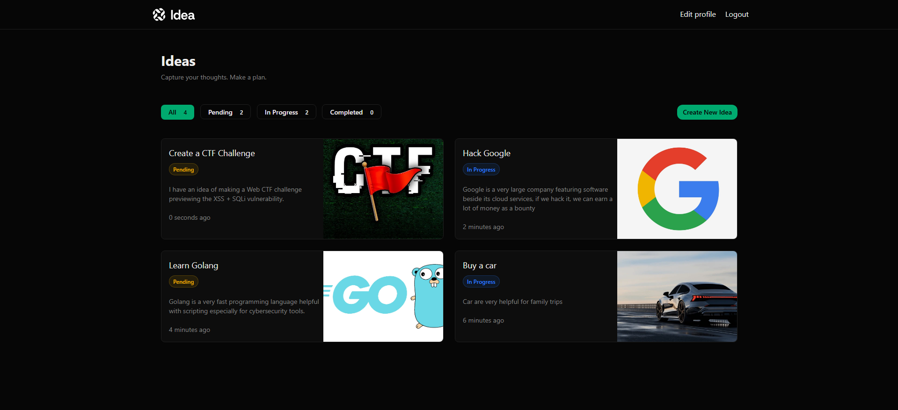
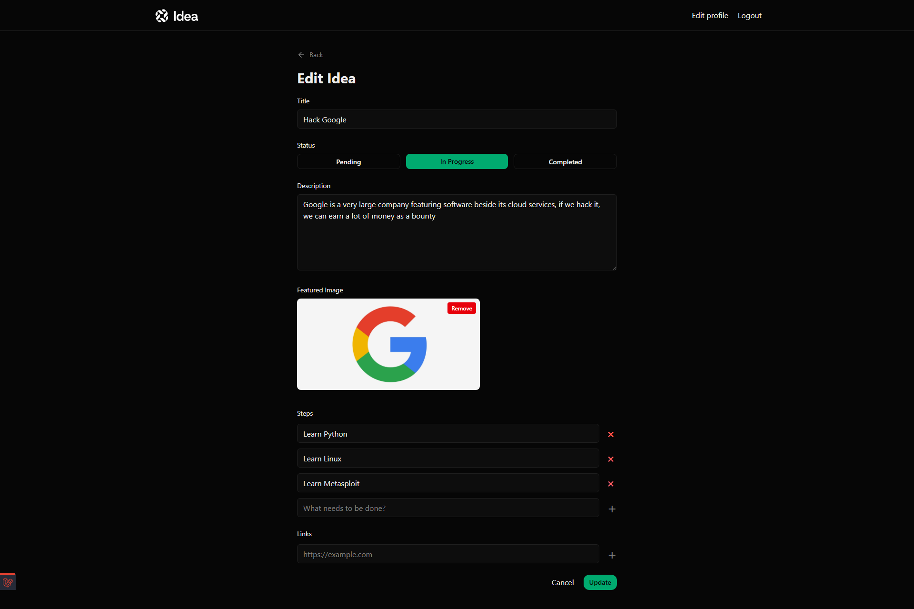

# Laravel Ideas Tracker

An elegant, robust web application built with Laravel to track, manage, and progress your ideas. This project provides a complete modern tech stack for seamless Idea management, image handling, and step tracking.

## Features

- **User Authentication:** Complete registration, login, and profile management system.
- **Idea Management:** Full CRUD operations (Create, Read, Update, Delete) for your ideas.
- **Image Uploads:** Attach, preview, replace, and remove images on your ideas.
- **Idea Steps:** Track the progress of an idea with actionable steps.
- **Categorization & Statuses:** Easily organize ideas by category and check their current status.
- **Modern UI:** Responsive and dynamic interface built with Tailwind CSS and Alpine.js.

## Tech Stack

- **Backend:** Laravel (v13), PHP 8.3
- **Frontend:** Tailwind CSS (v4), Alpine.js, Blade Templates, Vite
- **Testing:** Pest / Playwright Browser Testing

---

## Screenshots







---

## Setup & Installation

1. **Clone the repository:**
   ```bash
   git clone <repository-url>
   cd Laravel-Ideas-Tracker
   ```

2. **Install Composer dependencies:**
   ```bash
   composer install
   ```

3. **Install NPM dependencies:**
   ```bash
   npm install
   ```

4. **Environment Setup:**
   ```bash
   cp .env.example .env
   php artisan key:generate
   ```

5. **Database Migration:**
   *By default, the project is configured to use SQLite.*
   ```bash
   php artisan migrate
   ```

6. **Run the Development Server:**
   ```bash
   npm run dev
   # (This concurrently runs Vite, PHP server, Queue, and Logs using concurrently)
   ```

Visit `http://localhost:8000` in your browser.
